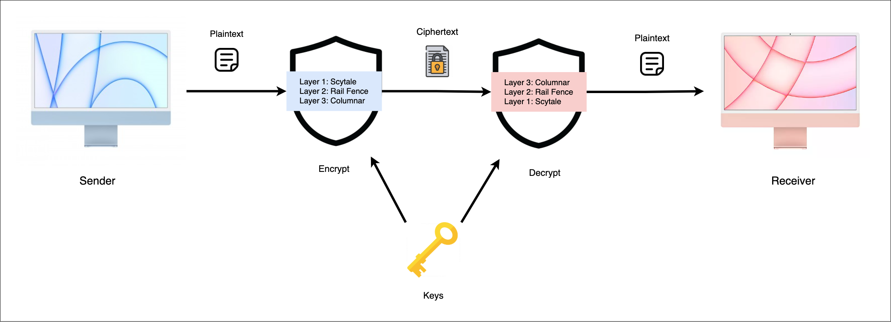
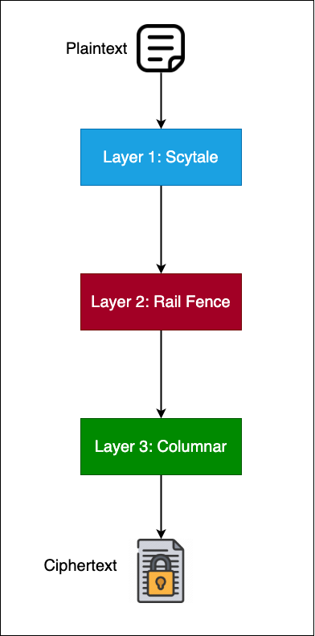
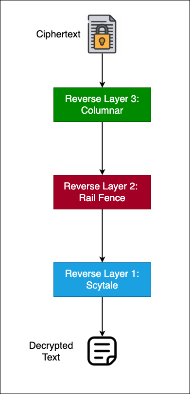
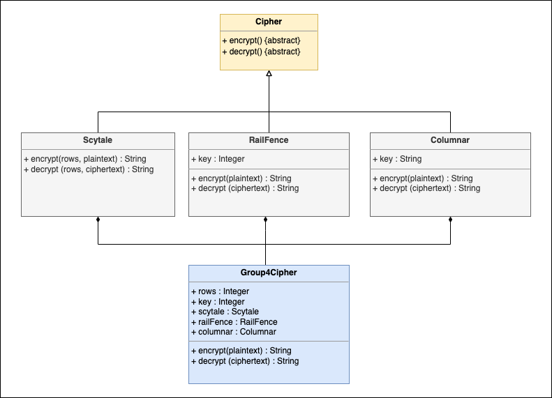

# Scytale-RailFence-Columnar Combination Cipher

Scytale-RailFence-Columnar Combination Cipher is a command-line Python program that performs encryption and decryption using three back-to-back cipher operations: Scytale, Rail Fence, and Columnar. The program ensures a highly secure ciphertext by using two keys, an integer key for Scytale and Rail Fence, and a string key for Columnar Cipher.

## Encryption Process

The sender provides a plaintext input to the encryption algorithm, which applies the three layers of ciphers using the specified keys. The steps involved in encryption are as follows:

1. **Scytale**: The Scytale cipher operates by rearranging the characters in the plaintext based on the number of rows specified by the integer key.
2. **Rail Fence**: The Rail Fence cipher rearranges the characters by writing them in a zigzag pattern across a set number of "rails" determined by the integer key.
3. **Columnar**: The Columnar cipher rearranges the characters in columns based on the characters' positions in the string key, which should not contain any duplicate characters.

The result of these three cipher operations is a highly-secure ciphertext.

## Decryption Process

To decrypt the ciphertext, the receiver uses the same keys as the sender and applies the reverse of the encryption operations. The decryption algorithm performs the following steps:

1. **Columnar**: The Columnar cipher reverses the columnar rearrangement by using the string key.
2. **Rail Fence**: The Rail Fence cipher reverses the zigzag pattern to reconstruct the original order of the characters.
3. **Scytale**: The Scytale cipher reverses the rearrangement performed by Scytale encryption to obtain the original plaintext.

The decryption process yields the original plaintext, preserving capitalizations, positions, and punctuations.

## Usage

To use the Scytale-RailFence-Columnar Combination Cipher program, follow these steps:

1. Clone the repository or download the source code.
2. Open a command-line interface and navigate to the program's directory.
3. Run the program using the Python interpreter, providing the necessary inputs for encryption or decryption.
4. View the output, which will be either the ciphertext or the decrypted plaintext, depending on the chosen operation.

Please note that the program already contains pre-defined keys for encryption and decryption. These keys are hard-coded and cannot be modified by the user.

## Class Diagram

The program utilizes Object-oriented programming (OOP) principles, as depicted in the class diagram. The key classes and their relationships are as follows:

- **Cipher**: An abstract class serving as the blueprint for the three layers of ciphers. It contains abstract methods `encrypt()` and `decrypt()`, which are overridden by the subclasses.
- **Scytale**: A cipher layer that performs the Scytale cipher operation. It overrides `encrypt()` and `decrypt()`.
- **RailFence**: A cipher layer that performs the Rail Fence cipher operation. It overrides `encrypt()` and `decrypt()`.
- **Columnar**: A cipher layer that performs the Columnar cipher operation. It overrides `encrypt()` and `decrypt()`.
- **Group4Cipher**: The core class of the program, utilizing composition by referencing objects of Scytale, RailFence, and Columnar. It contains instance variables for rows, key, and methods `encrypt()` and `decrypt()`.

Feel free to refer to the class diagram for a better understanding of the program's structure.

## References

1. Åhlén, J. (n.d.). Columnar Transposition Cipher Decoder and Encoder. Retrieved from Boxentriq : https://www.boxentriq.com/code-breaking/columnar-transposition-cipher
2. Columnar Transposition Cipher . (n.d.). Retrieved from PRACTICAL cryptography: http://practicalcryptography.com/ciphers/columnar-transposition-cipher/
3. Josh, F. (2020, OCTOBER 15). What is cryptography? How algorithms keep information secret and safe. Retrieved from CSO: https://www.csoonline.com/article/3583976/what-is-cryptography-how-algorithms-keep-information-secret-and-safe.html
4. Kelly, T. (July 1998). THE MYTH OF THE SKYTALE. Cryptologia , 244-260. 
5. Samarth Godara, S. K. (2018). Retrieved from An Improved Algorithmic Implementation of Rail Fence Cipher: http://article.nadiapub.com/IJFGCN/vol11_no2/3.pdf
6. Weber, M. (2019, May 12). Cryptography - History &amp; Basics. Retrieved from inversegravity.net: https://inversegravity.net/2019/crypto-history-basics/

